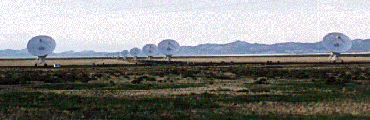

NCAR RAP Surface Stations Database Utility
===

Utility used to download the stations text file from http://weather.rap.ucar.edu/.  
Uses [sqlite-jdbc-3.8.11.1](https://www.sqlite.org/)

***

How to run this project with [Eclipse](https://eclipse.org/) (Windows, Mac OS X, and Linux):  

If the *EGit* plug-in is already installed go to step 3.  

1. Open Eclipse
2. Install *EGit* from the *Eclipse Marketplace*  (Help => Eclipse Marketplace...)
3. Right click inside Package Explorer (Window => Package Explorer) and choose "Import..." 
1. Expand the "Git" folder and choose "Projects from Git"
2. Choose "Clone URI" and enter the git repository HTTPS address [https://github.com/droidjst/SurfaceStationsDecoder.git](https://github.com/droidjst/SurfaceStationsDecoder.git)
3. Some of the form fields will automatically populate with the URL information
1. Enter your GitHub username and password if you're going to be contributing to the project, otherwise you can leave it blank
2. Choose "Next"
3. Add a tick mark to the "master" branch
1. Choose "Next"
2. Enter a location to store the remote copy, preferably the /git folder found in the user directory
3. Keep the initial branch set to "master"
1. The remote name can be anything, although it's traditionally titled "origin"
2. Choose "Finish"

Troubleshooting:    
If there is an error with the Referenced Libraries folder make sure the Project Build Paths (Right click the project in Project Explorer => Build Path => Configure Build Path...) have both the sqlite-jdbc jar file referenced, with a tick mark under the "Order and Export" section.  For all other inquiries send me an email droidjst@gmail.com.  

***

How to run this project via the command line (Windows, Mac OS X, and Linux):

The Java 1.7 JDK (or above) must be installed on the computer and the /bin folder must listed in the System Environment Variables (run "java -version" in Command Prompt).  

Since this project was developed in Eclipse there is a package structure which is difficult to work with on the command line.  A batch file (for Windows) and bash script (for Mac OS X and Linux) will be provided in a future update.  

For more information on compiling via the command line, see the following link:  [http://docs.oracle.com/javase/7/docs/technotes/tools/windows/javac.html](http://docs.oracle.com/javase/7/docs/technotes/tools/windows/javac.html)

***

Copyright 2015 Joseph Tranquillo <droidjst@gmail.com>  

